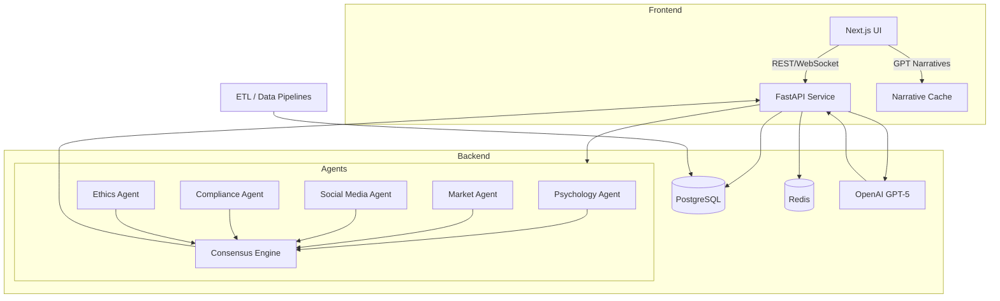

# Simulation v2 – High-Level Architecture



## Component Notes
- **UI**: Renders immersive scenes, connects via WebSocket for live agent updates, fetches REST endpoints for static data.
- **API**: FastAPI app exposes REST+WebSocket, orchestrates agent tasks, persists data, and manages GPT calls.
- **Agents**: Modular Python packages encapsulating domain logic; orchestrator negotiates consensus and fairness guards.
- **Data Layer**: PostgreSQL for structured NIL data; Redis for session state, GPT cache, and streaming coordination.
- **Integrations**: GPT-5 for narrative generation; ETL scripts for ingesting athlete/program metrics.
```
